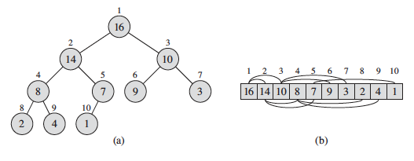
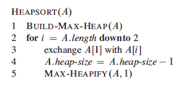

# Heap sort

## Algorithm

Heapsort algorithm use a data structure ("heap") to manage information. More specifically, we use max-heaps so the largest element is stored at the root. Here is a figure of a max-heap viewed as (a) a binary tree and (b) an array.

  

The heapsort algorithm starts by using the procedure BUILD-MAX-HEAP that converts an array A[1..n] into a max-heap, where n = A.length. It's the first step of creating a max-heap with the array we want to sort. 

In BUILD-MAX-HEAP we call the procedure MAX-HEAPIFY, its input are the array A and an index i into the the array. The procedure assumes that the binary trees rooted at LEFT(i) and RIGHT(i) are max-heaps, but that A[i] might be smaller than its children, thus violating the max-heap property. So It's this procedure that makes sure the max-heap is well created. 

Since the maximum element of the array is stored at the root A[i], we put it into its correct final position by exchanging it with A[n]. "If we now discard node n from the heap, and we can do so by simply decrementing A.heap-size, we observe that the children of
the root remain max-heaps, but the new root element might violate the max-heap property. All we need to do to restore the max-heap property, however, is call MAX-HEAPIFY(A, 1), which leaves a max-heap in A[1..n-1]. The heapsort algorithm then repeats this process for the max-heap of size n-1 down to a heap of size 2."

Since BUILD-MAX-HEAP have a running time of O(n) and each of the n-1 calls to MAX-HEAPIFY have a running time of O(log n), the heapsort algorithm takes time O(n log n).

#### Running time :

  - Worst case perfomance : O(n log n)
  - Best case perfomance : O(n log n)
  - Average case perfomance : O(n log n)

#### Pros and cons:

- Heapsort combines the better attributes of the merge sort(running time is O(n lg n)) and of the insertion sort(sorts in place).

## Pseudocode

This is the pseudocode you find in the book:

 

