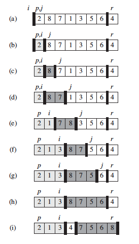

# Quick sort

## Algorithm

Quick sort is an "in place " sorting algorithm that use the divide and conquer paradigm.
The algorithm start by employing a partition function:
  - We choose an element in a vector (in our case) that will be our pivot. In our algorithm we choose the last element to be the pivot.
  - Then the cursor (refering at the first element) advances till the end of the vector.
  - At each iteration, if the value of the cursor is no greater than the value of the pivot, the element will be place in the first partition (ligthly shaded elements in the figure).
  - If the value of the cursor is greater than the value of the pivot, the element will be put in the second partition (heavily shaded elements in the figure).
  - At the end we will have 2 partitions and the pivot will be placed between the 2 partitions.
  - This figure taken from the book shows the partition algoritm :

  

Once we have the 2 partitions, we only have to re-execute the quicksort algorithm on each partition.

#### Running time :

  - Worst case perfomance : O(n^2)
  - Best case perfomance : O(n log n)
  - Average case perfomance : O(n log n)

#### Pros and cons:

Despite the slow worst-case running time, quicksort is often the best practical choice for sorting because it's efficient on the average.

## Pseudocode

This is the pseudocode you find in the book:

 

